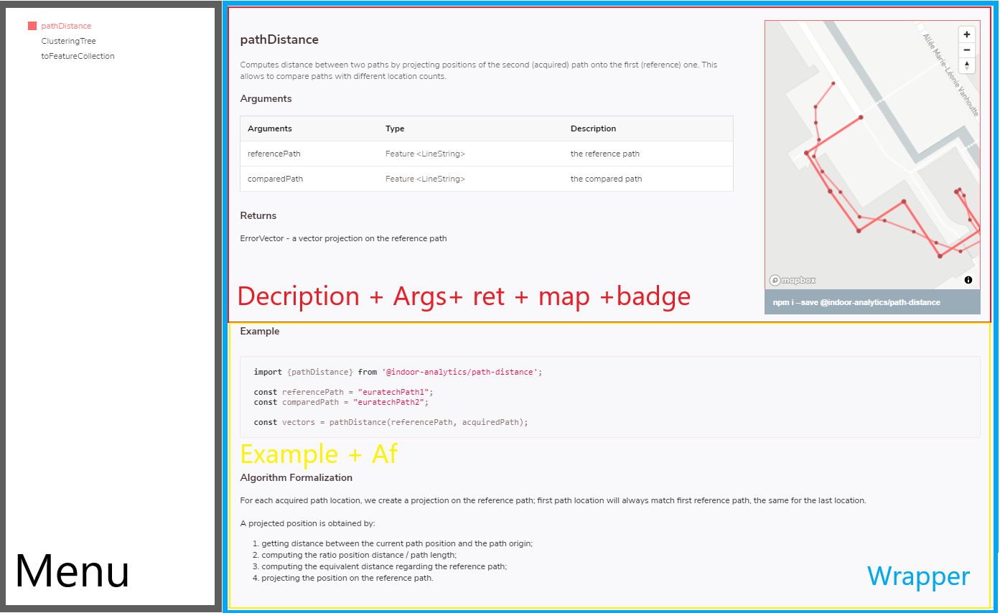

# Indoor Analytics Documentation Website

Rendu du PJI 2021, concernant la documentation de la bibliothèque `indoor-analytics`.

* https://github.com/indoor-analytics/

Le site est actuellement déployé sur `github-pages`:

* https://chapeaur0uge.github.io/indoor-analytics/

Par **Denis Barlet** sous la supervision de **Rémy Raes** et **Romain Rouvoy**.

## Roadmap
---
### partie 1: prélude - **5hr**
---
La première chose que j'ai faite avant de demarrer le projet, trouver sur quelles technologies je me reposerais.

En effet, je me suis posé les questions suivantes:

  * Le site web aura t'il besoin d'une base de données ?
  * Un site web reposant sur une SPA (Single page application).
  * L'Hebergement du website ?
  * L'ajout de la doc, statique ou dynamique ?
  * Comment gérer les dépendances ?

Après quelques heures de reflexions et de lecture d'exemple de docs, mais surtout un guidage sur une partie des technologies sur le travail attendu de **Romain Rouvoy**.

J'ai choisi:
    
  * Le deploiement d'un site `statique` sur github-pages.
  * L'utilisation de `mapbox-gl` pour les exemples de fonctions de la bibliothèque.
  * `Turf.js` pour une utilisation avec `mapbox-gl`. 
  * Deux pages, une pour la "vitrine", l'autre pour la documentation pure.

J'ai donc une idée plus ou moins claire de ce que je veux atteindre comme objectif à la fin.

---
### partie 2: MAPBOX-GL - **15hr**
---
Le premier travail qui m'a été demander par **Romain Rouvoy** est la mise en place d'une carte avec un bouton generate pour placer quelques marqueurs sur celle-ci.

La première chose est la consultation de la documentation officiel de mapbox:
* https://docs.mapbox.com/mapbox-gl-js/api/#quickstart

Je comprends vite comment déployer une carte, pour celà j'ai besoin de deux choses:

* Un "entrypoint" dans un fichier html.
    ```html
    <div id="map">
        <!-- MAP WILL BE INJECTED HERE-->
    </div>
    ```

* Du code JS pour l'instanciation de la map, (ici dans un fichier JS à part).
    ```javascript
    import mapboxgl from 'mapbox-gl';

    // public token from Mapbox-gl
    mapboxgl.accessToken =""
    const map = new mapboxgl.Map({
        container: 'map', // ID div
        style: 'mapbox://styles/mapbox/streets-v11', // style URL
        center: [-74.5, 40], // starting position [lng, lat]
        zoom: 9 // starting zoom
    });
    ```
Le plus simple étant fait, j'ai chercher comment interéagir avec cette `map`, il suffit d'utilisé la méthode `addControl();`:

```javascript
map.addControl(new mapboxgl.NavigationControl()); /*Add navigation control*/
```

Maintenant que je sais ça, je crée un bouton `generate` sous forme d'icône sur la carte, mais avant celà je crée une classe `CustomButtonControl`.

Celle-ci me permet de crée des boutons custom sur la carte (voir premiers commits pour le code).

Je peux maintenant injecter ce bouton sur la carte:
```javascript
const ctrlAddRandomPts = new CustomButtonControl({
    eventHandler: addTwoRandomPoints,
    className: "generate",
    title: "generate"
});

map.addControl(ctrlAddRandomPts, "bottom-left");
```

Mais il faut que je place des marqueurs aléatoirement sur la carte en appuyant sur celui-ci, lors du clique :
```javascript
function addTwoRandomPoints(event){
    let geo_points = turf.randomPoint(2, {bbox: turf.bbox(turf.lineString(lille))});
    /*Add points to map*/
    geo_points.features.forEach(function(marker) {

        let m = new mapboxgl.Marker();

        // make a marker for each feature and add to the map
          m
          .setLngLat(marker.geometry.coordinates)
          .addTo(map);

        // Save Marker for clear after
        current_markers.push(m);
    });
}
```

Remarquons que j'utilise `turf.js`, le site étant bien documenté, je n'ai eu aucun problèmes de compréhension.

Je fais la même chose en implémentant un bouton clear, qui va supprimer tout les marqueurs, sur la carte.

Pour résumer, lorsque que j'appuis sur le bouton `generate`, deux marqueurs sont placé aléatoirement sur la `carte` dans la zone de Lille (bbox turf).

Lorsque que j'appuis sur `clear`, tout les marqueurs sont supprimés.

Cette première partie se conclue sur une reussite, cette carte restera sur la page principale jusqu'à très recement (voir anciens commit).

---
### partie 3: Le Front-end  - **20hr**
---

Après avoir eu maitrise de la carte, j'ai chercher un moyen de la mettre en valeur, grâce au front.

Néamoins j'arrive vite à la conclusion qu'il est temps de trouver un moyen de préparé un style pour l'acceuil de la librarie, à l'heure où je commence cette partie, seul "pathDistance" est disponible sous forme de paquet `npm`.

Je me concentre donc sur deux points importants:
* Mise en place de la map précedente sur une page d'acceuil.
* La documentation de `pathDistance` à la façon `turf.js`.

N'étant pas un bon UX/UI designer (et n'ayant pas le temps de partir "from scratch"), je cherche donc un template libre de droit sur lequel partir.

Très vite je tombe sur un template qui me donne des idées :
* https://github.com/amiechen/codrops-scribbler

Celui-ci sous licence MIT n'a aucune limitations, parfait pour notre projet.

Je remarque très rapidement, les limitations de celui-ci, au niveau de css, qui ne correspond pas vraiment à ce que nous voulons pour la partie documentation.

Une très grande partie de mon temps est donc consacré, à la réalisation d'un modèle CSS de turf.js, qui sera intégré à la section documentation.

Après de très longues heures de tests, de documentations et de bugs en tout genre, j'arrive à maquetter les premiers designs de la documentation.



J'entamme un deuxième sprint pour la correction des bugs css, des flexbox qui bug, des titres aussi ...

J'ai maintenant deux, pages sur la première, je prend vite la décision d'afficher la map etdans les tabs et features, dans le premier les instructions "comment installer la paquet" et dans l'autre une description rapide du package. (d'autres choses sont toujours possible, bien sur).

Pour résumer, cette partie à surtout été consacré à la mise en place d'un premier front, les deux pages ont pas mal de dépendence, beaucoup de fichier js à inclure c'est pour ça que je vais avoir besoin de bundleliser tout ça.

